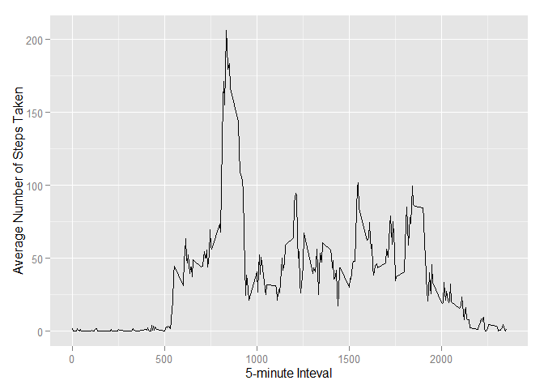

## Reproducible Research: Peer Assessment 1  - Beth Fioretta 
------------------------------------------------------------  

```{r setoptions, echo = TRUE}  # Display code  
```

## Loading and preprocessing the data

```r
unzip("activity.zip")  
data <- read.csv("activity.csv")  
```

## What is mean total number of steps taken per day?

```r
library(ggplot2)  
total.dailysteps <- tapply(data$steps, data$date, FUN=sum, na.rm=TRUE)  
qplot(total.dailysteps, xlab="Total # of Steps Per Day", ylab="Days", fill=I("blue"), 
  main="Histogram of the Total Number of Steps Taken Each Day\n(NAs removed)")  
```

 

```r
# The mean number of steps is:
mean(total.dailysteps, na.rm=TRUE)  
```

```
## [1] 9354.23
```

```r
# The median number of steps is:
median(total.dailysteps, na.rm=TRUE)
```

```
## [1] 10395
```

## What is the average daily activity pattern?  

```r
library(ggplot2)  
avgPattern <- aggregate(x=list(steps=data$steps), by=list(interval=data$interval), 
  FUN=mean, na.rm=TRUE)  
ggplot(data=avgPattern, aes(x=interval, y=steps)) + geom_line() + 
  xlab("5-minute Inteval")+ ylab("Average Number of Steps Taken")  
```

 

### On average across all days in dataset, the 5 minute interval that contains the maximum number of steps is:  

```r
avgPattern[which.max(avgPattern$steps),]  
```

```
##     interval    steps
## 104      835 206.1698
```

## Inputing missing values  
## Fill in missing values with the mean value for that 5 minute interval 

```r
fill.value <- function(steps, interval) {  
        filled <- NA
        if (!is.na(steps))  
          filled <- c(steps)  
        else  
          filled <- (avgPattern[avgPattern$interval==interval, "steps"])  
        return(filled)
}
filled.data <- data
filled.data$steps < mapply(fill.value, filled.data$steps, filled.data$interval)
```
## What is mean total number of steps taken per day now that missing values have been replaced with the mean for that 5-minute interval?

```r
total.dailysteps <- tapply(filled.data$steps, filled.data$date, FUN=sum)  
qplot(total.dailysteps, xlab="Total # of Steps Per Day", ylab="Days", fill=I("blue"), 
  main="Histogram of the Total Number of Steps Taken Each Day\n(NAs replaced with mean for that 5-minute interval)")  
```

 

```r
#The mean number of steps is:
mean(total.dailysteps, na.rm=TRUE)  
```

```
## [1] 10766.19
```

```r
#The median number of steps is:
median(total.dailysteps, na.rm=TRUE)  
```

```
## [1] 10765
```

```r
#The mean and median values are higher after replacing the NA values with the mean value across all days for that particular 5-minute interval  
```

## Are there differences in activity patterns between weekdays and weekends?

```r
weekday.weekend <- function(date) {  
  day <- weekdays(date)  
  if (day %in% c("Monday", "Tuesday", "Wednesday", "Thursday", "Friday"))  
    return("weekday")  
  else  
    return("weekend")  
}  
filled.data$date <- as.Date(filled.data$date)  
filled.data$day <- sapply(filled.data$date, FUN=weekday.weekend)  
```

##Panel plot of average number of steps taken on weekdays and weekends  

```r
averages <- aggregate(steps ~ interval + day, data=filled.data, mean)  
ggplot(averages, aes(interval, steps)) + geom_line() + facet_grid(day ~ .) + 
  xlab("5-Minute Interval") + ylab("Number of Steps")  
```

 
